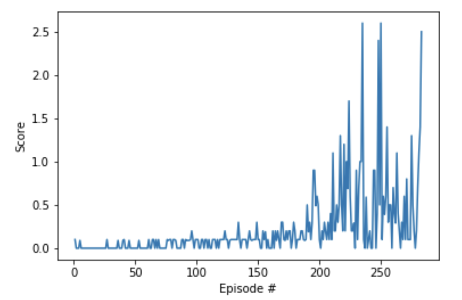

## Methodology

This project is built on top of the DDPG agent I implemented for the previous project [Continuous Control](https://github.com/croepke/drlnd-project-2). The difference is that it got adapted for the multi-player coordinative scenario in this project.

I trained a single agent (consisting of two local and target networks for the Actor and Critic respectively) with a shared replay buffer by letting the two players play against each other.

The DDPG algorithm is based on the paper by [Lilicrap et. al.](https://arxiv.org/pdf/1509.02971.pdf).

DDPG is an Actor-Critic method that adopts the concepts of Q-Learning to a continuous domain. The Actor learns the policy directly and outputs the actions for the agents to take. The Critic approximates the action-value function Q(s,a) and outputs a single output given a state. The DDPG algorithm generates trajectories through interaction with the environment. Thereby, the actors selects actions. The trajectories are stored in a replay buffer and then randomly sampled to prevent correlations over time. The trajectories are used to train the critic network and approximate the state-value function. In the initial DQN paper it was shown that splitting training into target and local networks helped to stabilize learning significantly by fixing the targets against which to optimize, hence it was adapted here. The same applies to soft-updates instead of directly copying the network weights. In order to help the actor network with exploration and exploitation during traing an Ornstein-Uhlenbeck process is used to generate random noise. The noise gets scaled, added to the output of the actor network and clipped to keep it within the desired output range.

## Implementation

The network comprises of 2 networks:

**Actor**   
Input: state-size=24  
Hidden 1: Linear(512) -> ReLU  
Hidden 2: Linear(256) -> ReLU  
Output: Linear(action-size=2) -> TANH

**Critic**   
Input: state-size=24
Hidden 1: Linear(512) -> ReLU  
Concat: Concat(Critic-Hidden-1, Actor-Output)  
Hidden 2: Linear(256+action-size) -> ReLU -> Dropout(0.2)  
Output: Linear(1)

**Hyperparameters**

- replay buffer size = 1e5
- minibatch size = 512
- discount factor = 0.99
- tau for soft update of target parameters = 2e-1
- learning rate of the actor = 1e-4
- learning rate of the critic = 3e-4
- L2 weight decay = 0
- number of timesteps until update = 5
- number of updates per agent update = 10

## Results

The agents were able to solve the task after 283 episodes with a final average score of 0.51.

You can see a sample of the trained agents playing against each other here:

## Enhancements

- It will be possible to further improve the results by tuning the networks scructures (adding layers or units per layers, ...) and hyperparameters
- Adding prioritized experience replay could reduce the training time further, make the training process more stable and reduce the sensititivity to hyperparameter changes
- Implement TRPO, PPO, D3PG or D4PG that probably would produce even better results
- Implement a full version of the Multi-Agent DDPG that will train with two separate Actor/Critic Networks
